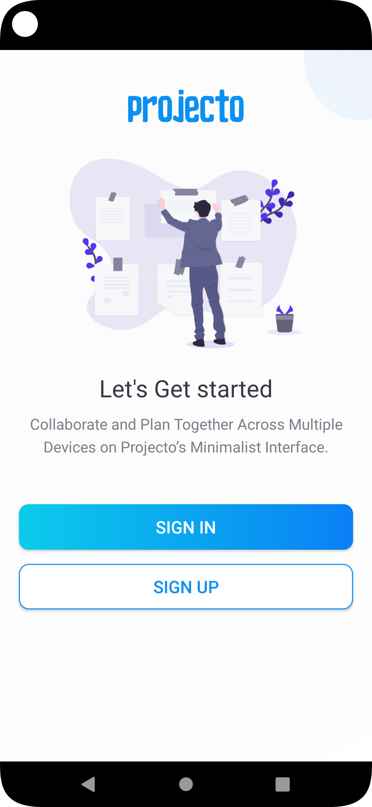
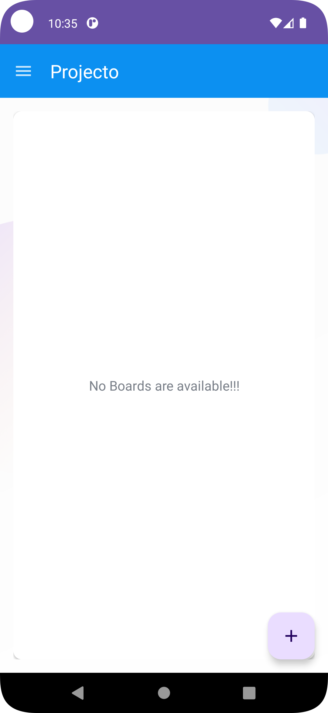
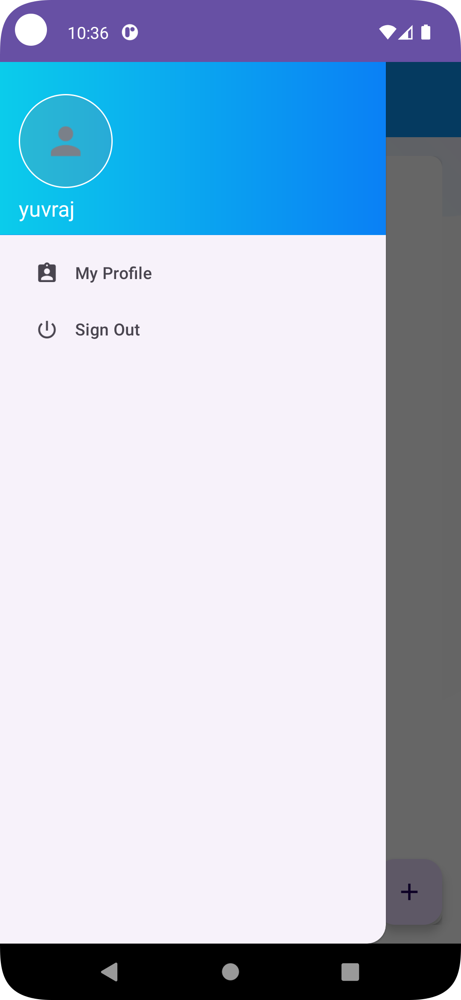
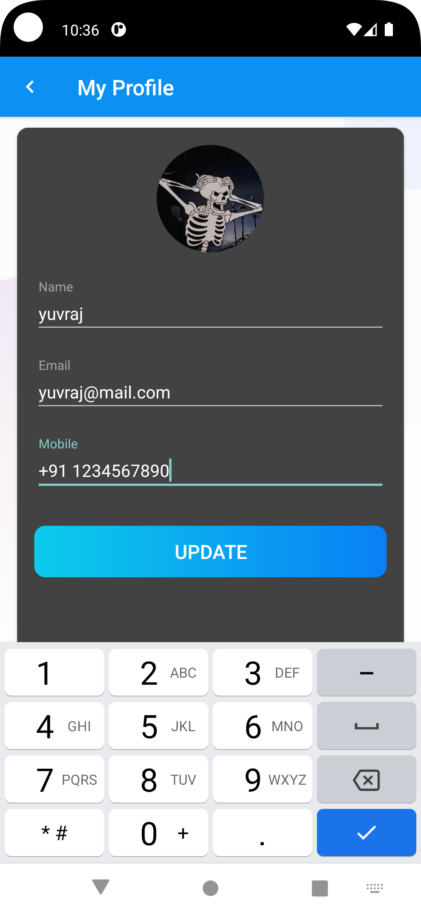
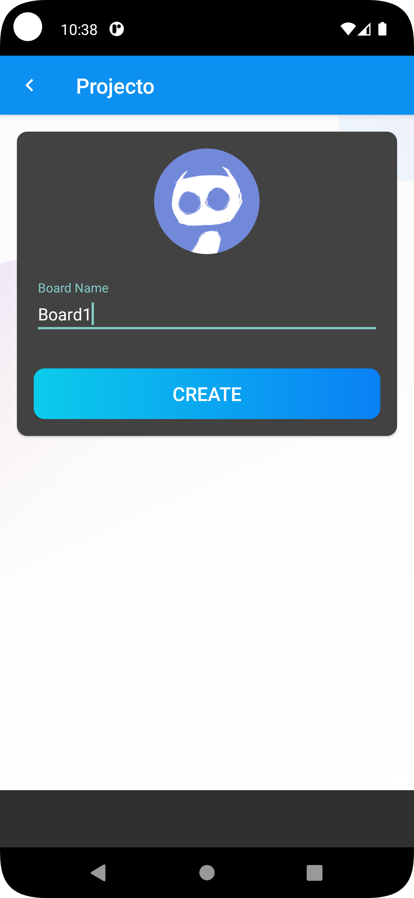
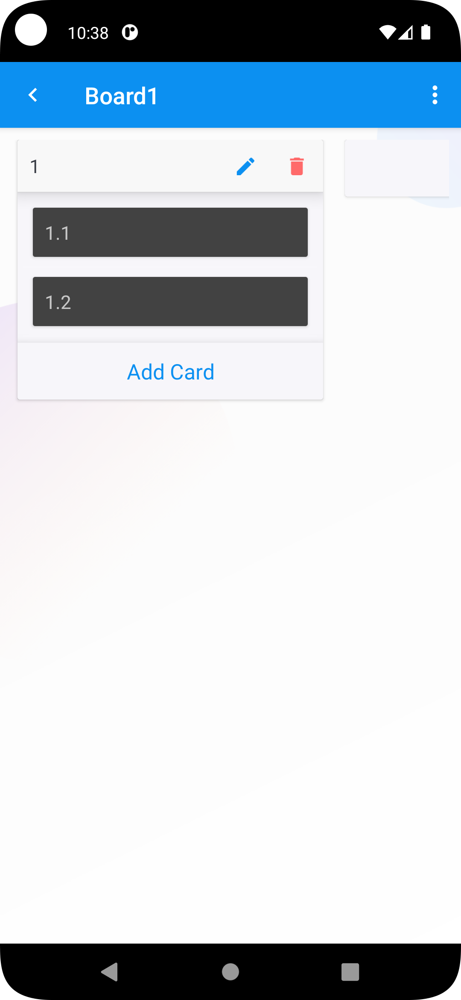
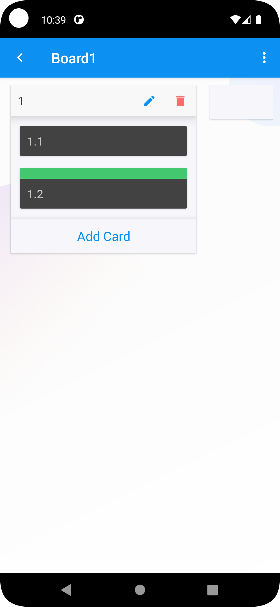

Projecto is a Trello Clone Android Application developed using Kotlin

# Features
> 1. Manage your tasks with another members easily with real time collaboration.
> 2. Uses Firebase Authentication for secure access control and utilized Firestore to manage user data including boards, lists and cards.
> 3. Each Member has all the boards he is assigned to.
> 4. Each Board has all the lists with task cards.
> 5. Cards can be moved up and down in the list.
> 6. Easily update user settings - set name, image and phone.
> 7. Easily update cards - set label color, assign members and add due date.

# Screenshots

